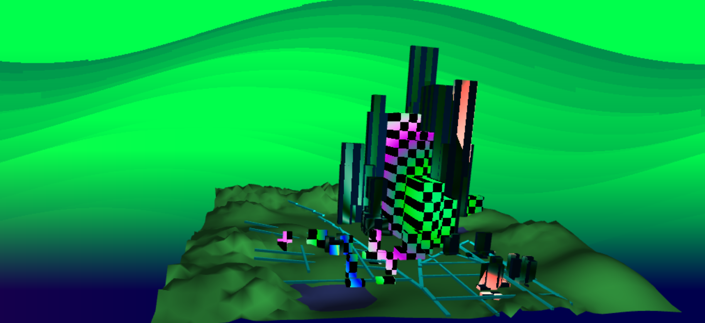
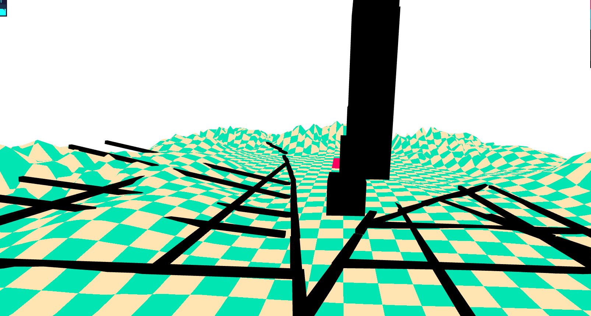
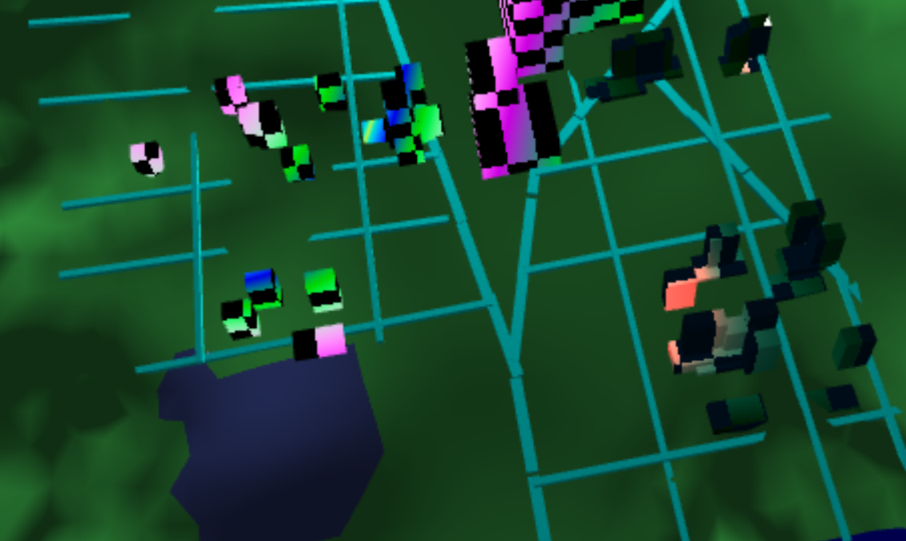
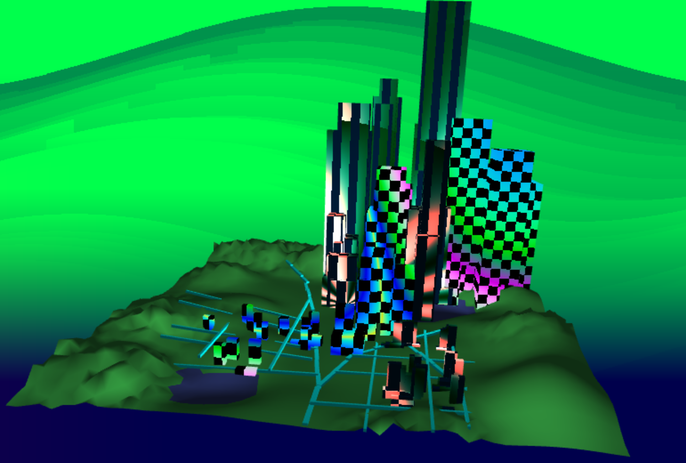
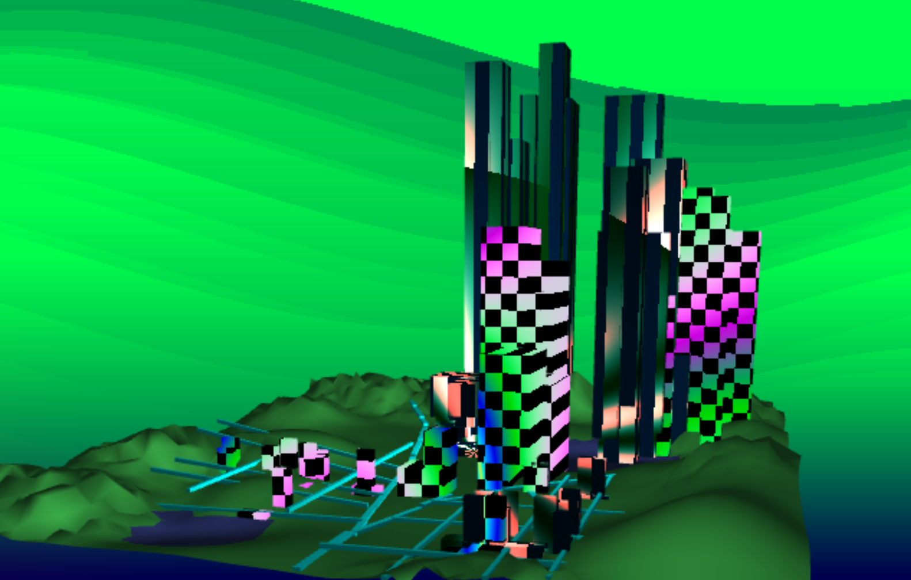

# Homework 6: City Generation :)

For this assignment, you will generate a collection of 3D buildings within the road networks you created for the previous assignment.

For this assignment, you will generate a network of roads to form the basis of a city using a modified version of L-systems. As in homework 4, you will be using instanced rendering to draw your road networks.

## Provided Resources
You can use any base code for this assignment, so we haven't provided
anything specific for you. We have included the paper [Real-time Procedural Generation of 'Pseudo Infinite' Cities](procedural_infinite_cities.pdf) for your reference. For visual inspiration, you might refer to Emily's [City Forgery](http://www.emilyhvo.com/city-forgery/) project.

## Assignment Requirements
#### 3D MODEL OF TERRAIN
This 3D model was generated based on the image of the previous homework map.  I incorporated a subdivided plane which I modified with Maya, to give some landscaping around the edges as opposed to totally flat terrain. 
#### ROADS
For the road segments, I used a rectangular prism OBJ file similar to how I used plant leaf OBJ files for homework 4.   Having built the plane off of an instance of running the previous homework, I stored one set of edges so that the roads are consistent each time the program is run.

#### 2D GRID
On the CPU, I created a high-resolution 2D grid that spans the terrain for the scene. The points where the road and water exist are stored as invalid areas, where a building will not be placed if the user tries to put a building there randomly.  I was able to visualize this 2D grid by using a checkered shader as a guide for building placement.  Below, you can visualize the initial grid setup with several buildings placed in the scene.

#### RANDOM POINTS ON THE GRID
I treated the "city" and "towns" as separate entities due to their different types of buildings.
For the towns, I randomly generated points along the x and z axis.  If this point fell too close to the x or y of any of the city block roads, this point was discarded, and another new random point was tried.  For the most part, you will find that the smaller buildings effectively appear in valid terrain space. 
With more time, I would hope to improve my intersection testing to ensure no buildings ever cross the roads, but there is occasional overlap due to random width and length of the building bases.

For the city portion, I generated random points within a certain x/z range and also randomized the height at which the buildings would reach.  In terms of art direction, I purposelly correlated the height of the skyscrapers with the -Z direction.  In terms of a visually appealing city, I felt it would look more natural to have larger, taller buildings occur with an increased frequency towards the back of the scene.  The goal was preventing massive buildings blocking smaller ones from view in the back.

In order to generate the randomized height, I used a cubic function that took into account random values, as well as the proposed Z coordinate for the new building.  Buildings at a greater distance from the camera had a greater probability of being taller. 
The cubic function results in medium/smaller buildings at the start of the city, and more "skyscrapers" in the distance.

Below, you will see the pseudorandom nature of the city, with height influence that favors taller structures further away.

#### CREATING BUILDING GEOMETRY - ALGORITHM
!! Allow me to explain my awesome building generation method.

To start, I modified a SQUARE VBO geometry class to accept input, and generate geometry for any input --> starting X, Y, Z, and extrusion properties -> like length, width and height.
Feeding in any data to this class will produce geometry with the desired output. We can refer to this as a "BLOCK".

- Creating a Building
Each building is made up of one or more BLOCKS. Given some random Y start point and a height for this start block, the shape is extruded downwards by the given height.  If the building has not yet reached y = 0.0, we extrude once more.  The next tier is computed by setting the new start height to the bottom of the first block.  We then add two more blocks with a slight random x/z offset, and extrude those downwards as well. The result of the offset produces some irregular, n-sided polygon.
This process repeats until we reach the ground level.

Once we get within a certain threshhold of the ground, the extrusion will simply extend to 0.0 as opposed to branching again. For example, if the next extrusion takes us to a height of 0.5 above ground, the block will continue extruding itself to 0.

Each building, therefore is composed of an array of BLOCKS.  We draw all of these blocks to visualize the building.
I also allowed for specific types of buildings, explained below:

##### Type 1:
Given a start height, draw one block straight to the ground.  This is the structure of a simple, straight building.
##### Type 2:
Given a start height, draw one block to some distance still above ground. The next tier is composed of two additional blocks, which are then both extended to the ground.
##### Type 3:
Follows the same procedure as Type 2, but adds a third tier underneath with a much wider base composed of 2 MORE blocks that reaches the ground.

Town/Home buildings are primarily type 1, while skyscrapers and medium buildings are more likely to be of types 2 and 3.

#### ART DIRECTION - STRUCTURE AND HEIGHT

As mentioned above, I created both town and city classes, where cities have much higher population as opposed to small towns. As a result of this, towns are much more likely to have buildings of type 1, possibly 2, but city buildings are more likely to be taller and tiered. (type 3)
As previously mentioned, I directed the city region to have increasing population with increasing distance from the cameras position. This influences the city to be more visually appealing, with more taller buildings appearing in the back of the landscape.

This results in the residential structure within the towns, and skyscrapers within the city area.

#### ART DIRECTION - SHADERS!

I created several fragment shaders to color the buildings.
In order to create a window pattern, I modified a checkerboard glsl shader - https://www.geeks3d.com/hacklab/20190225/demo-checkerboard-in-glsl/ . Wherever the windows (white) occurr, I compute the result of another colored shader to fill the windows with electric/cyberpunky colors.

I modified the windows randomly on different buildings, so that some have long floor/ceiling window stripes, and others have traditional square windows.

#### LIGHTING
I used lambert shaders from several different directions, averaging them together to make the shading flicker like an ocean floor. This creates some shadowlike appearance on both the terrain floor and the buildings! As a result, there are no total dark shadows in the scene. 

#### PROCEDURAL BACKGROUND
For my background, I worked with the following shader as a basis for noise - http://glslsandbox.com/e#22429.6
I then turned it into a green, wavelike motion to go with the city's style.

